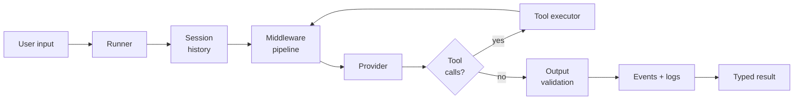

<!-- ══════════════════════════════════════════════════════════════════ -->
<!--                             HERO                                  -->
<!-- ══════════════════════════════════════════════════════════════════ -->

<div align="center">

<!-- Drop your logo here once you have one:

-->

<h1>Aniki&nbsp;SDK</h1>

<p>
  <b>The provider-agnostic TypeScript SDK for production AI agents.</b>
</p>

<p>
  Tools, structured output, streaming, middleware, logging and lifecycle events —<br/>
  in one strongly-typed API, with no framework lock-in.
</p>

<p>
  <a href="https://docs.aniki.dev"></a>
  <a href="https://aniki.dev"></a>
  <a href="https://discord.gg/aniki"></a>
</p>

<p>
  
  = 18" />
  
  
  
  
</p>

<p>
  <a href="#-quickstart"><b>Quickstart</b></a> ·
  <a href="#-core-concepts"><b>Concepts</b></a> ·
  <a href="#-capabilities"><b>Capabilities</b></a> ·
  <a href="#-providers"><b>Providers</b></a> ·
  <a href="#-aniki-cloud"><b>Cloud</b></a> ·
  <a href="#-roadmap"><b>Roadmap</b></a>
</p>

</div>

---

## Why Aniki

Most agent frameworks make the easy demo trivial and the production path painful. You end up
fighting hidden control flow, untyped model output, and a retry loop you can't see into.

Aniki inverts that. The `Runner` owns the entire execution lifecycle — history, middleware,
provider calls, tool execution, output validation — and every layer is an interface you can
replace. Nothing is magic, nothing is global, and **no step trusts the model's raw text**.

<table>
  <tr>
    <td width="33%" valign="top">
      <b>&#9679;&nbsp; Type-safe end to end</b><br/><br/>
      <sub>Strict TypeScript with no <code>any</code>. An <code>output</code> schema flows through generics, so <code>result.output</code> is typed and validated before it reaches your code.</sub>
    </td>
    <td width="33%" valign="top">
      <b>&#9679;&nbsp; Provider-agnostic</b><br/><br/>
      <sub>Agents depend on the <code>IProvider</code> contract, never a vendor SDK. Swap OpenAI for a local model by changing one string.</sub>
    </td>
    <td width="33%" valign="top">
      <b>&#9679;&nbsp; Composable middleware</b><br/><br/>
      <sub>Express-style pipeline wrapping each provider round trip — retries, caching and logging compose safely with the tool loop.</sub>
    </td>
  </tr>
  <tr>
    <td valign="top">
      <b>&#9679;&nbsp; Observable by default</b><br/><br/>
      <sub>Canonical lifecycle events for every run, LLM call and tool invocation. Pipe them into your own APM in a few lines.</sub>
    </td>
    <td valign="top">
      <b>&#9679;&nbsp; Secure by construction</b><br/><br/>
      <sub>Credentials are redacted at any nesting depth before a log line is written. Event payloads are read-only and never carry secrets.</sub>
    </td>
    <td valign="top">
      <b>&#9679;&nbsp; Genuinely lightweight</b><br/><br/>
      <sub>One runtime dependency (Zod). Dual ESM/CJS build, bundled types, fast cold start — safe for serverless and edge-adjacent runtimes.</sub>
    </td>
  </tr>
</table>

---

## &#128230; Installation

```bash
npm install aniki-sdk
```

<sub><b>Requires Node.js 18 or later.</b> Ships ESM and CJS builds with bundled type declarations — no <code>@types</code> package needed.</sub>

```bash
# pnpm
pnpm add aniki-sdk

# yarn
yarn add aniki-sdk

# bun
bun add aniki-sdk
```

---

## &#9889; Quickstart

Configure once, then build agents anywhere in your application.

```ts
import { Aniki, Agent, Runner } from "aniki-sdk";

Aniki.configure({
  provider: "openai",
  apiKey: process.env.OPENAI_API_KEY,
  defaultModel: "gpt-5.5",
  timeout: 30_000,
});

const agent = new Agent({
  name: "Assistant",
  instructions: "You are a helpful assistant.",
  model: "gpt-5.5",
  provider: "openai",
});

const runner = new Runner();
const result = await runner.run(agent, { message: "Hello" });

console.log(result.content);                    // the assistant's final reply
console.log(result.metadata.usage?.totalTokens); // token accounting
console.log(result.iterations);                  // provider round trips this turn
```

If `apiKey` is omitted, Aniki resolves it from the provider's environment variable
(`OPENAI_API_KEY`, `ANTHROPIC_API_KEY`, `GROQ_API_KEY`, …). Missing credentials fail fast with a
`ConfigurationError` at construction — never mid-run, in production, at 3&nbsp;a.m.

---

## &#129513; Core concepts

Four objects cover almost everything you'll build.

| Object | Responsibility |
| --- | --- |
| **`Agent`** | A pure configuration container — instructions, model, tools, output schema, session, middleware. Never talks to a provider. |
| **`Runner`** | The execution engine. Orchestrates the full lifecycle and is the only component allowed to call a provider. |
| **`Tool`** | A self-describing, independently testable capability with typed input/output schemas. |
| **`Session`** | Storage-independent conversation history behind the `ISession` interface. |

Every run follows the same path, and no module is permitted to bypass the `Runner`:



---

## &#128736; Capabilities

<details>
<summary><b>&#128295;&nbsp; Tools — typed, testable, and orchestrated for you</b></summary>

<br/>

A `Tool` is a name, a description, an input schema, an optional output schema, and an `execute`
function. Attach tools to an `Agent` and the `Runner` automatically calls the model, executes
whatever it requests, feeds results back, and repeats until a final answer arrives.

```ts
import { Tool } from "aniki-sdk";
import { z } from "zod";

const weatherTool = new Tool({
  name: "get_weather",
  description: "Get the current weather for a city.",
  input: z.object({ city: z.string() }),
  output: z.object({ tempC: z.number(), summary: z.string() }),
  execute: async ({ city }) => ({ tempC: 21, summary: `Clear skies in ${city}` }),
});

const agent = new Agent({
  name: "Assistant",
  instructions: "You are a helpful assistant.",
  model: "gpt-5.5",
  provider: "openai",
  tools: [weatherTool],
  maxToolIterations: 5,
});

const result = await new Runner().run(agent, { message: "What's the weather in Gaya?" });

result.content;     // the model's final answer
result.toolResults; // every tool call made along the way, in execution order
```

**Tools are unit-testable with zero LLM involvement.** `Tool.run` validates the input, executes,
and validates the output — no agent, provider, or network call required:

```ts
await weatherTool.run({ city: "Gaya" });
// { tempC: 21, summary: "Clear skies in Gaya" }
```

Duplicate tool names are rejected at construction by the `ToolRegistry`. Runaway loops are capped
by `maxToolIterations` (default `5`), which throws `MaxToolIterationsError` rather than silently
burning your budget.

</details>

<details>
<summary><b>&#127919;&nbsp; Structured output — validated, typed, never trusted</b></summary>

<br/>

Give an `Agent` a Zod `output` schema and `Runner.run` returns a schema-validated, typed
`result.output` instead of raw text. The schema flows through generics, so the agent's type
changes with it.

```ts
const UserSchema = z.object({ name: z.string(), email: z.string() });

const agent = new Agent({
  name: "Extractor",
  instructions: "Extract the user described in the message.",
  model: "gpt-5.5",
  provider: "openai",
  output: UserSchema, // infers Agent<{ name: string; email: string }>
});

const result = await new Runner().run(agent, { message: "Lalit, lalit@example.com" });

result.output.email; // typed and validated: "lalit@example.com"
```

Structured output is prompt-driven and portable across every provider: the `Runner` **appends**
format instructions to the system message — it never replaces your `instructions` — then runs the
response through extraction, `JSON.parse`, and Zod validation before it reaches your code.

Failures are explicit, not silent. A response with no JSON payload throws `OutputParseError`; a
payload that parses but fails the schema throws `OutputValidationError`. Both carry a truncated
snippet of the raw model text for debugging. There is deliberately **no automatic repair/retry
loop** — a malformed response is a thrown error you control, not a hidden second invoice.

</details>

<details>
<summary><b>&#128260;&nbsp; Streaming — token deltas or typed events, your choice</b></summary>

<br/>

`Runner.stream` opens a turn and returns a `RunStream` immediately, without waiting for
completion. Consume it three ways — as an async iterable of typed events, as delta text only, or
by awaiting the final validated result.

```ts
// Delta text only
for await (const token of runner.stream(agent, { message: "Hi" }).textStream) {
  process.stdout.write(token);
}

// Typed events, plus the final result
const stream = runner.stream(agent, { message: "Hi" });
for await (const event of stream) {
  if (event.type === "delta") render(event.text);
}
const result = await stream.result; // metadata.streamed === true
```

Pick whichever channel fits — touching more than one throws `StreamConsumedError`, since the
underlying provider stream can only be read once.

Call `stream.abort(reason?)` to cancel early; it surfaces `StreamAbortedError` through whichever
channel is currently consuming. The assistant message is appended to the session **only** once the
stream completes successfully, including schema validation — a stream that throws leaves the
session holding just that turn's user message, so a retry starts from a clean state.

> **Note** &nbsp;Streaming does not support tool calls in this release. `Runner.stream` throws
> `StreamingNotSupportedError` synchronously — before opening any request — if the agent has
> registered tools or its provider reports `capabilities.streaming === false`.

</details>

<details>
<summary><b>&#128279;&nbsp; Middleware — retries, caching and logging that compose</b></summary>

<br/>

Middleware wraps **a single provider round trip**, not the whole of `Runner.run`. That distinction
is what makes it safe with the tool loop: a retried attempt never replays session history, and a
cache key stays meaningful per iteration.

```ts
import { Runner, LoggingMiddleware, CacheMiddleware, RetryMiddleware, ConsoleLogger } from "aniki-sdk";

const runner = new Runner(undefined, undefined, {
  middleware: [
    new LoggingMiddleware({ logger: new ConsoleLogger({ level: "info" }) }),
    new CacheMiddleware({ ttlMs: 60_000 }),
    new RetryMiddleware({ maxAttempts: 3 }),
  ],
});
```

Runner-level middleware runs first, then any configured on the `Agent`. With none configured,
behaviour is identical to not having the pipeline at all — you pay nothing for what you don't use.

Write your own by extending `BaseMiddleware`:

```ts
import { BaseMiddleware } from "aniki-sdk";
import type { MiddlewareRequest, MiddlewareNext } from "aniki-sdk";

class TimingMiddleware extends BaseMiddleware {
  constructor() {
    super("TimingMiddleware");
  }
  async execute(request: MiddlewareRequest, next: MiddlewareNext) {
    const start = Date.now();
    const result = await next(request);
    console.log(`${request.model} took ${Date.now() - start}ms`);
    return result;
  }
}
```

The built-ins are conservative on purpose:

- **`RetryMiddleware`** only retries what the provider layer already marked transient (a
  `ProviderResponseError` with `retryable: true`, e.g. `RateLimitError`). Validation, tool, output
  and auth errors rethrow immediately — retrying a bad API key just wastes wall-clock time.
- **`CacheMiddleware`** never caches a response carrying `toolCalls`, since replaying one would
  re-trigger its side effect. A broken cache backend degrades to a miss, never a failed run.

</details>

<details>
<summary><b>&#128221;&nbsp; Logging — pluggable, levelled, and credential-safe</b></summary>

<br/>

Every component that logs depends on the `ILogger` interface rather than `console`, and defaults
to `NoopLogger` — **nothing logs until you opt in.**

```ts
import { ConsoleLogger } from "aniki-sdk";

const logger = new ConsoleLogger({ level: "info", json: true });
logger.info("run started", { runId: "abc-123" });

const scoped = logger.child({ runId: "abc-123" });
scoped.debug("below the info threshold, dropped");
```

Fields passed to any log call are redacted before writing. `apiKey`, `authorization`, `api_key`,
`token`, `password` and `secret` — case-insensitive, at any nesting depth — are replaced with
`"[redacted]"`, so credentials can't reach a log aggregator even by accident.

Set `json: true` for structured output that drops straight into Datadog, Loki or CloudWatch.

</details>

<details>
<summary><b>&#128225;&nbsp; Events — a canonical lifecycle you can wire to any APM</b></summary>

<br/>

`Runner` emits a canonical set of lifecycle events. Subscribe with `on` (which returns an
unsubscribe function), or use `once` / `off` directly.

```ts
const unsubscribe = runner.on("llm:end", (event) => {
  metrics.histogram("llm.latency", event.durationMs, { model: event.model });
});

runner.once("agent:end", (event) => console.log(`run ${event.runId} finished`));
```

| Event | Payload highlights |
| --- | --- |
| `agent:start` | `runId`, `agentName`, `model`, `providerName` |
| `agent:end` | + `durationMs`, `iterations` |
| `agent:error` | `agentName`, `error` |
| `llm:start` | `iteration`, `messageCount` |
| `llm:end` | + `durationMs`, `finishReason?`, `usage?` |
| `llm:error` | `iteration`, `error` |
| `tool:start` | `toolName`, `toolCallId`, `call` |
| `tool:end` | + `durationMs`, `ok` |
| `tool:error` | `toolName`, `toolCallId`, `error` |
| `middleware:error` | `error`, `middlewareName?` |

Event payloads are read-only and never carry credentials — listeners observe a run, they never
influence it. `EVENT_NAMES` (a frozen tuple) and `LEGACY_EVENT_ALIASES` are exported for callers
that need to enumerate or validate against them. Legacy event names are still emitted immediately
after their canonical counterparts, so upgrading breaks nothing.

</details>

<details>
<summary><b>&#9881;&nbsp; Configuration — one call, reused everywhere</b></summary>

<br/>

```ts
Aniki.configure({
  provider: "openai",
  apiKey: process.env.OPENAI_API_KEY,
  baseURL: "https://api.openai.com/v1",
  timeout: 30_000,
  retryCount: 3,
  defaultModel: "gpt-5.5",
  defaultProvider: "openai",
});
```

Configuration resolves in a strict precedence order — **explicit argument → global `Aniki` config
→ environment variable** — so a local override never requires unpicking your global setup.
`Aniki.getConfig()` returns a frozen snapshot, and invalid input throws `ConfigurationError`
at configure time rather than at first request.

</details>

<details>
<summary><b>&#128680;&nbsp; Errors — a typed hierarchy, never a raw provider dump</b></summary>

<br/>

Every error extends `AnikiError`, so a single `catch` can branch on `instanceof` with no string
matching. Raw provider errors are always translated before they reach you.

| Category | Errors |
| --- | --- |
| **Configuration** | `ConfigurationError`, `ValidationError` |
| **Provider** | `AuthenticationError`, `RateLimitError`, `ProviderTimeoutError`, `ProviderConnectionError`, `InvalidRequestError`, `ModelNotFoundError`, `ProviderResponseError` |
| **Tools** | `ToolNotFoundError`, `DuplicateToolError`, `ToolInputValidationError`, `ToolOutputValidationError`, `ToolExecutionError`, `ToolTimeoutError`, `MaxToolIterationsError` |
| **Output** | `OutputParseError`, `OutputValidationError`, `OutputProcessingError` |
| **Streaming** | `StreamConsumedError`, `StreamAbortedError`, `StreamingNotSupportedError` |
| **Middleware** | `MiddlewareContractError`, `MiddlewareExecutionError`, `RetryExhaustedError`, `CacheError` |

```ts
import { RateLimitError, OutputValidationError } from "aniki-sdk";

try {
  await runner.run(agent, { message: "Hello" });
} catch (error) {
  if (error instanceof RateLimitError) return scheduleRetry(error);
  if (error instanceof OutputValidationError) return reportBadSchema(error);
  throw error;
}
```

</details>

---

## &#127760; Providers

Providers implement the `IProvider` contract and are resolved by name through a registry, so
**adding one never requires touching existing code**. Register your own in a single call and it
becomes available to every agent by string name.

| Provider | Status | Streaming |
| --- | --- | --- |
| **OpenAI** | ✅ Available | ✅ |
| Anthropic | 🔜 In progress | — |
| Google Gemini | 🔜 In progress | — |
| Groq | 📋 Planned | — |
| OpenRouter | 📋 Planned | — |
| Ollama _(local)_ | 📋 Planned | — |
| **Custom / self-hosted** | ✅ Available today | Your call |

```ts
import { defaultProviderRegistry, ProviderFactory } from "aniki-sdk";

defaultProviderRegistry.register("my-llm", (config) => new MyProvider(config));

const agent = new Agent({ /* ... */, provider: "my-llm" });
```

The OpenAI integration is split into focused, individually tested units — request builder,
response parser, error translator, auth strategy and HTTP client — so a new vendor means
implementing an interface, not forking the runtime.

---

## &#9729;&#65039; Aniki Cloud

The SDK is the open core and is free forever. **Aniki Cloud** is the hosted layer for teams
running agents in production — the parts you'd otherwise rebuild in-house.

<table>
  <tr>
    <td width="25%" valign="top">
      <b>Observability</b><br/><br/>
      <sub>Every run, LLM call and tool invocation traced from the same lifecycle events the SDK already emits. No extra instrumentation.</sub>
    </td>
    <td width="25%" valign="top">
      <b>Cost &amp; token analytics</b><br/><br/>
      <sub>Spend broken down by agent, model, tool and customer — before the invoice arrives.</sub>
    </td>
    <td width="25%" valign="top">
      <b>Managed keys &amp; routing</b><br/><br/>
      <sub>Rotate credentials, set per-team rate limits and fail over between providers without a redeploy.</sub>
    </td>
    <td width="25%" valign="top">
      <b>Evaluations</b><br/><br/>
      <sub>Replay production traces against a new prompt, model or schema and diff the results before shipping.</sub>
    </td>
  </tr>
</table>

<div align="center">
  <br/>
  <a href="https://aniki.dev/cloud"></a>
  <br/><br/>
  <sub>Self-hosting will always be a first-class option. Nothing in the SDK requires an account.</sub>
</div>

---

## &#128218; Documentation

| Resource | Link |
| --- | --- |
| 📖 Full documentation | **[docs.aniki.dev](https://docs.aniki.dev)** |
| 🚀 Getting started guide | [docs.aniki.dev/quickstart](https://docs.aniki.dev/quickstart) |
| 🧩 API reference | [docs.aniki.dev/api](https://docs.aniki.dev/api) |
| 🛠 Building custom tools | [docs.aniki.dev/tools](https://docs.aniki.dev/tools) |
| 🔌 Writing a provider | [docs.aniki.dev/providers](https://docs.aniki.dev/providers) |
| 💡 Example projects | [docs.aniki.dev/examples](https://docs.aniki.dev/examples) |
| 📝 Changelog | [docs.aniki.dev/changelog](https://docs.aniki.dev/changelog) |

Every exported class and method carries JSDoc with examples, so your editor is the fastest
reference you have.

---

## &#129514; Engineering standards

This is not a weekend prototype. The codebase is built to the standards you'd expect from a
dependency you're putting on your critical path.

<table>
  <tr>
    <td width="50%" valign="top">
      <b>Tested</b><br/><br/>
      <sub>380 unit tests across 37 suites. Every provider request is mocked — the test run makes no network calls and needs no API key.</sub>
    </td>
    <td width="50%" valign="top">
      <b>Strictly typed</b><br/><br/>
      <sub>TypeScript strict mode, zero <code>any</code>, <code>readonly</code> by default, generics wherever they buy real safety.</sub>
    </td>
  </tr>
  <tr>
    <td valign="top">
      <b>Architecturally disciplined</b><br/><br/>
      <sub>Single Responsibility and Open/Closed applied module by module. Composition over inheritance throughout.</sub>
    </td>
    <td valign="top">
      <b>Backward compatible</b><br/><br/>
      <sub>Deprecated event names still fire alongside their replacements. New capabilities arrive as opt-in surfaces, not breaking changes.</sub>
    </td>
  </tr>
</table>

```bash
npm test              # run the suite
npm run test:coverage # coverage report
npm run lint          # eslint
npm run format        # prettier
npm run build         # tsup → dist/ (ESM + CJS + .d.ts)
```

---

## &#128506;&#65039; Roadmap

**Shipped**

- ✅ Core architecture — `Agent`, `Runner`, `Session`, `Context`, `Memory`
- ✅ Provider abstraction layer with OpenAI integration
- ✅ Tool system — registry, executor, validation, timeouts
- ✅ Structured output — extraction, Zod validation, typed results
- ✅ Streaming — `RunStream`, delta text, typed events, abort
- ✅ **Middleware, pluggable logging and canonical lifecycle events**

**Next**

- 🔜 Anthropic and Gemini providers · native OpenAI tool-call wire format
- 🔜 Persistent session backends — Redis, SQLite, file storage
- 🔜 Streaming with tool calls · parallel tool execution
- 📋 Multi-agent workflows and agent-to-agent handoff
- 📋 Human approval steps for sensitive tools
- 📋 RAG support · MCP integration · plugin system
- 📋 CLI and project template generator

Have a use case that needs one of these sooner? [Open an issue](https://github.com/lalit999999/Aniki-SDK/issues) — roadmap order follows real demand.

---

## &#129309; Contributing

Contributions are welcome, particularly new providers and middleware.

1. Fork the repository and create a branch — `feature/your-feature`
2. Follow the conventions in [`Claude.md`](./Claude.md) — strict types, single responsibility, no cross-module business logic
3. Add tests; mock all external requests
4. Add JSDoc to every exported class and method
5. Run `npm test && npm run lint && npm run format:check`
6. Open a pull request describing the behaviour change

Bug reports and feature requests belong in [Issues](https://github.com/lalit999999/Aniki-SDK/issues).

---

## &#128172; Community

<div align="center">

<p>
  <a href="https://x.com/anikisdk"></a>
  <a href="https://discord.gg/aniki"></a>
  <a href="https://linkedin.com/company/aniki-sdk"></a>
</p>

<p>
  <a href="https://github.com/lalit999999/Aniki-SDK"></a>
  <a href="https://www.npmjs.com/package/aniki-sdk"></a>
  <a href="https://youtube.com/@anikisdk"></a>
</p>

<p><sub>Questions, demos and provider requests are all fair game in Discord.</sub></p>

</div>

---

## &#128220; License

Released under the **ISC License**. See [`LICENSE`](./LICENSE) for details.

<div align="center">
  <br/>
  <sub>Built with care by <a href="https://github.com/lalit999999">@lalit999999</a>.</sub>
  <br/>
  <sub>If Aniki saves you a few hours, a ⭐ on the repo goes a long way.</sub>
  <br/><br/>
</div>